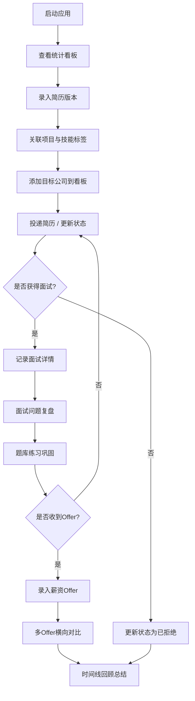

# 个人面试准备与求职进度追踪助手 - 产品需求文档

## 1. 产品概述

个人面试准备与求职进度追踪助手是一款面向求职者的全流程管理工具，帮助用户系统化管理简历版本、追踪公司投递进度、记录面试复盘、练习面试题库、对比薪资Offer，从而提升求职效率与面试成功率。

- 核心目标：解决求职者信息分散、进度混乱、复盘缺失、决策困难等痛点
- 目标用户：正在求职的职场人士、应届毕业生、换岗转型者

## 2. 核心功能

### 2.1 用户角色

| 角色 | 注册方式 | 核心权限 |
|------|----------|----------|
| 个人用户 | 本地数据存储，无需注册 | 全部功能使用、数据增删改查、自定义配置 |

### 2.2 功能模块

1. **统计看板**：核心指标概览、趋势图表、岗位分布
2. **简历管理**：多版本简历、项目经历关联、技能标签、投递统计
3. **目标公司看板**：卡片墙拖拽、状态流转、面试进度追踪
4. **面试记录**：面试详情、问题分类复盘、反馈记录、高频题回顾
5. **面试题库**：200+预置题、分类管理、难度分级、随机抽题模拟
6. **薪资谈判**：薪资结构录入、多Offer横向对比、自动计算总包
7. **求职时间线**：全流程时间轴展示、节点追踪

### 2.3 页面详情

| 页面名称 | 模块名称 | 功能描述 |
|----------|----------|----------|
| 统计看板 | 核心指标卡 | 投递总数、面试转化率、Offer率、平均面试周期 |
| 统计看板 | 趋势图表 | 按月柱状图展示投递量与面试量趋势 |
| 统计看板 | 岗位分布 | 岗位方向饼图分布展示 |
| 简历管理 | 简历列表 | 多版本简历卡片展示、按行业/岗位筛选 |
| 简历管理 | 简历详情 | 关联项目经历、技能标签、投递次数与面试率统计 |
| 简历管理 | 新增/编辑 | 录入简历版本信息、关联项目、技能标签管理 |
| 目标公司看板 | 状态列看板 | 9个状态列、拖拽卡片切换状态、每列自动计数 |
| 目标公司看板 | 公司卡片 | 公司基本信息、当前状态、关联简历版本 |
| 目标公司看板 | 新增/编辑 | 公司信息录入、投递状态管理 |
| 面试记录 | 面试列表 | 按时间排序、按公司/形式筛选 |
| 面试记录 | 面试详情 | 日期时间、面试官信息、面试形式、问题复盘、自评与反馈 |
| 面试记录 | 高频题回顾 | 按问题分类统计高频题目 |
| 面试题库 | 题库浏览 | 按岗位方向/难度/类型筛选、状态标注 |
| 面试题库 | 随机抽题 | 模拟面试模式、随机抽取指定数量题目 |
| 面试题库 | 自定义题目 | 用户新增题目、分类与难度设置 |
| 薪资谈判 | Offer列表 | 录入的Offer薪资结构卡片 |
| 薪资谈判 | 对比表格 | 多Offer横向对比、总包自动计算、优劣标注 |
| 求职时间线 | 时间轴视图 | 从投递到Offer/拒信全链路节点展示 |

## 3. 核心流程

### 3.1 主要用户流程

用户启动应用后，首先查看统计看板了解整体求职进度。然后可通过侧边栏导航进入各功能模块：录入简历版本并关联项目技能 → 在公司看板中添加目标公司并投递 → 随着进度推进拖拽公司卡片更新状态 → 收到面试后记录面试详情与问题复盘 → 在题库中练习面试题并标注掌握程度 → 收到Offer后录入薪资结构进行多Offer对比 → 通过时间线回顾整个求职历程。

## 4. 用户界面设计

### 4.1 设计风格

- **主色调**：深邃蓝紫渐变（#1e1b4b → #312e81），象征专业与进取
- **辅助色**：
  - 成功绿：#10b981（Offer/通过状态）
  - 警告橙：#f59e0b（面试中状态）
  - 行动蓝：#3b82f6（投递/进行中）
  - 拒绝灰：#6b7280（已拒绝状态）
- **背景风格**：深色玻璃拟态（Glassmorphism），磨砂卡片，渐变光晕点缀
- **按钮风格**：圆角矩形（12px）、悬停微放大、发光描边
- **字体方案**：
  - 标题：Noto Serif SC（衬线字体，庄重专业）
  - 正文：Noto Sans SC（无衬线，清晰易读）
  - 数据数字：JetBrains Mono（等宽字体，表格对齐）
- **布局风格**：左侧导航栏 + 主内容区，卡片式模块分区
- **交互动效**：页面切换淡入过渡、卡片悬停上浮、拖拽状态高亮、数据加载数字滚动动画

### 4.2 页面设计概览

| 页面名称 | 模块名称 | UI元素 |
|----------|----------|--------|
| 统计看板 | 核心指标卡 | 渐变背景卡片、数字动画、趋势箭头、图标徽章 |
| 统计看板 | 趋势图表 | 双色柱状图（投递蓝/面试橙）、网格线、悬浮tooltip |
| 统计看板 | 岗位分布 | 环形饼图、图例标签、百分比悬停显示 |
| 简历管理 | 简历列表 | 横向卡片布局、行业标签色块、投递计数徽标 |
| 简历管理 | 技能标签 | 圆角pill标签、点击筛选、渐变色系 |
| 目标公司看板 | 状态列 | 9列横向滚动布局、列头计数气泡、拖拽放置区高亮 |
| 目标公司看板 | 公司卡片 | 公司logo占位、状态色条、优先级角标、下拉菜单 |
| 面试记录 | 问题分类 | 技术题/行为题/算法题/项目追问四种色卡标签 |
| 面试记录 | 自评星级 | 1-5星评分组件、图标点击交互 |
| 面试题库 | 难度标识 | 简单（绿）/中等（黄）/困难（红）三色进度条 |
| 面试题库 | 抽题界面 | 随机翻卡动画、计时器、答题框 |
| 薪资谈判 | 对比表格 | 固定首列、数据色阶、总包加粗行、最优值高亮 |
| 求职时间线 | 节点轴 | 竖向时间线、节点圆点、连接线动画、状态色对应 |

### 4.3 响应式设计

- 桌面端优先（1440px及以上）：完整9列看板展示
- 平板端（768-1439px）：看板可横向滚动，侧边栏折叠为图标
- 移动端（<768px）：顶部tab导航，看板改为垂直堆叠列

### 4.4 动效与微交互

- 页面加载：顶部进度条 + 内容区块渐入（错开100ms）
- 拖拽卡片：提起缩放1.05 + 阴影加深，放置区绿色描边闪烁
- 数字统计：加载时从0滚动至目标值（800ms easeOut）
- 按钮悬停：背景色加深 + 轻微上移2px + 发光阴影
- 模态框：背景模糊 + 弹窗缩放进入（scale 0.9→1 + 透明度0→1）
