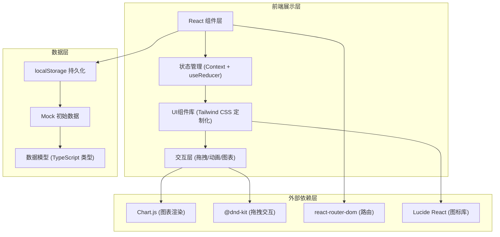
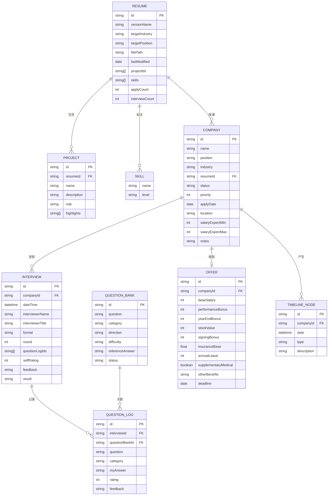

# 个人面试准备与求职进度追踪助手 - 技术架构文档

## 1. 架构设计



## 2. 技术描述

- **前端框架**：React@18 + TypeScript + Vite@5
- **样式方案**：TailwindCSS@3 + CSS变量（深色玻璃拟态主题）
- **状态管理**：React Context + useReducer（全局状态），localStorage 持久化
- **路由方案**：react-router-dom@6
- **图表库**：chart.js@4 + react-chartjs-2（柱状图/饼图渲染）
- **拖拽库**：@dnd-kit/core + @dnd-kit/sortable（看板卡片拖拽）
- **图标库**：lucide-react（高质量SVG图标）
- **初始化工具**：Vite create
- **后端服务**：无（纯前端应用，localStorage存储）
- **数据库**：localStorage（浏览器本地存储）
- **初始数据**：内置Mock数据（200+面试题、示例简历/公司/面试记录）

## 3. 路由定义

| Route | 页面名称 | 用途 |
|-------|----------|------|
| / | 统计看板 | 核心指标概览、趋势图表、岗位分布 |
| /resumes | 简历管理 | 多版本简历列表、详情、新增编辑 |
| /companies | 目标公司看板 | 9状态列卡片墙、拖拽管理 |
| /interviews | 面试记录 | 面试列表、详情、高频题回顾 |
| /questions | 面试题库 | 题库浏览、筛选、随机抽题 |
| /offers | 薪资谈判 | Offer录入、多Offer横向对比 |
| /timeline | 求职时间线 | 全流程时间轴展示 |

## 4. 数据模型

### 4.1 ER 图



### 4.2 核心状态定义 (TypeScript)

```typescript
type CompanyStatus = 
  | 'not_applied' 
  | 'applied' 
  | 'screening' 
  | 'invited' 
  | 'first_round' 
  | 'second_round' 
  | 'final_round' 
  | 'offer' 
  | 'rejected';

type QuestionCategory = 'technical' | 'behavioral' | 'algorithm' | 'project';
type Difficulty = 'easy' | 'medium' | 'hard';
type QuestionStatus = 'not_practiced' | 'practiced' | 'mastered' | 'need_review';
type InterviewFormat = 'phone' | 'video' | 'onsite';

interface AppState {
  resumes: Resume[];
  companies: Company[];
  interviews: Interview[];
  questionBank: QuestionBankItem[];
  offers: Offer[];
  timelineNodes: TimelineNode[];
}
```

### 4.3 状态管理 Reducer Action 定义

```typescript
type AppAction =
  // Resume actions
  | { type: 'ADD_RESUME'; payload: Resume }
  | { type: 'UPDATE_RESUME'; payload: Resume }
  | { type: 'DELETE_RESUME'; payload: string }
  // Company actions
  | { type: 'ADD_COMPANY'; payload: Company }
  | { type: 'UPDATE_COMPANY_STATUS'; payload: { id: string; status: CompanyStatus } }
  | { type: 'UPDATE_COMPANY'; payload: Company }
  | { type: 'DELETE_COMPANY'; payload: string }
  // Interview actions
  | { type: 'ADD_INTERVIEW'; payload: Interview }
  | { type: 'UPDATE_INTERVIEW'; payload: Interview }
  | { type: 'DELETE_INTERVIEW'; payload: string }
  // Question actions
  | { type: 'ADD_QUESTION'; payload: QuestionBankItem }
  | { type: 'UPDATE_QUESTION_STATUS'; payload: { id: string; status: QuestionStatus } }
  | { type: 'UPDATE_QUESTION'; payload: QuestionBankItem }
  // Offer actions
  | { type: 'ADD_OFFER'; payload: Offer }
  | { type: 'UPDATE_OFFER'; payload: Offer }
  | { type: 'DELETE_OFFER'; payload: string }
  // Timeline actions
  | { type: 'ADD_TIMELINE_NODE'; payload: TimelineNode };
```

## 5. 组件层级结构

```
src/
├── App.tsx                         # 路由入口、Provider包裹
├── main.tsx                        # 应用入口
├── contexts/
│   └── AppContext.tsx              # 全局状态Context + Reducer
├── data/
│   └── mockData.ts                 # 初始Mock数据（200+题库等）
├── types/
│   └── index.ts                    # 全局TypeScript类型定义
├── components/
│   ├── layout/
│   │   ├── Sidebar.tsx             # 侧边导航栏
│   │   └── Header.tsx              # 顶部栏
│   ├── common/
│   │   ├── StatCard.tsx            # 统计卡片组件
│   │   ├── Modal.tsx               # 通用模态框
│   │   ├── Badge.tsx               # 标签徽章
│   │   └── EmptyState.tsx          # 空状态组件
│   ├── dashboard/
│   │   ├── StatsOverview.tsx       # 核心指标卡片区
│   │   ├── TrendChart.tsx          # 投递/面试趋势柱状图
│   │   └── PositionPie.tsx         # 岗位分布饼图
│   ├── resume/
│   │   ├── ResumeCard.tsx          # 简历卡片
│   │   ├── ResumeForm.tsx          # 简历表单
│   │   └── SkillTag.tsx            # 技能标签
│   ├── companies/
│   │   ├── KanbanBoard.tsx         # 看板主体
│   │   ├── KanbanColumn.tsx        # 状态列
│   │   ├── CompanyCard.tsx         # 公司卡片（可拖拽）
│   │   └── CompanyForm.tsx         # 公司表单
│   ├── interview/
│   │   ├── InterviewList.tsx       # 面试列表
│   │   ├── InterviewDetail.tsx     # 面试详情
│   │   ├── InterviewForm.tsx       # 面试表单
│   │   ├── QuestionReview.tsx      # 问题复盘
│   │   └── HighFreqQuestions.tsx   # 高频题统计
│   ├── questions/
│   │   ├── QuestionFilters.tsx     # 题库筛选器
│   │   ├── QuestionList.tsx        # 题目列表
│   │   ├── QuestionCard.tsx        # 题目卡片
│   │   ├── QuestionForm.tsx        # 新增题目表单
│   │   └── RandomQuiz.tsx          # 随机抽题模拟
│   ├── offers/
│   │   ├── OfferList.tsx           # Offer列表
│   │   ├── OfferForm.tsx           # Offer录入表单
│   │   └── OfferComparison.tsx     # 多Offer对比表
│   └── timeline/
│       └── TimelineView.tsx        # 时间轴视图
├── pages/
│   ├── Dashboard.tsx
│   ├── Resumes.tsx
│   ├── Companies.tsx
│   ├── Interviews.tsx
│   ├── Questions.tsx
│   ├── Offers.tsx
│   └── Timeline.tsx
├── hooks/
│   └── useLocalStorage.ts          # localStorage持久化hook
└── utils/
    ├── salary.ts                   # 薪资计算工具
    ├── statistics.ts               # 统计计算工具
    └── date.ts                     # 日期处理工具
```
